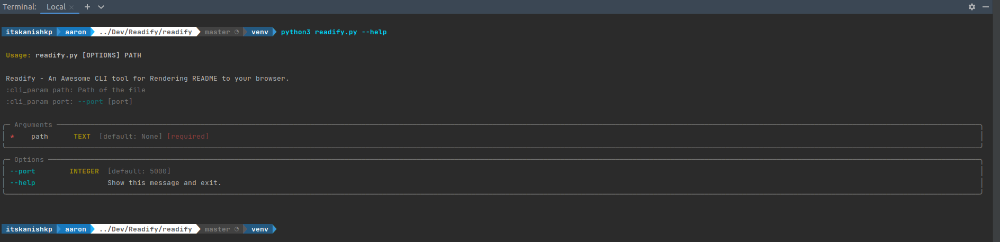
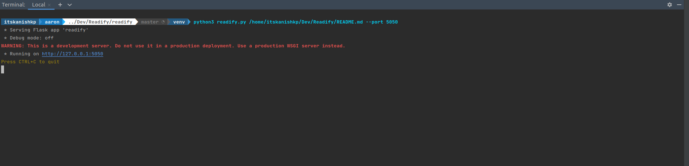
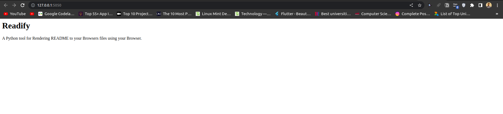

# Readify

A Python tool for Rendering README files to your Browsers.

## Setup
```bash
git clone https://github.com/Mr-Sunglasses/Readify.git 

cd readify

python3 -m venv venv

source env/bin/activate

pip3 install -r requirements.txt
```

## Usage
```bash
python3 readify.py --help

python3 readify.py <path of the readme> --port=<port in which you want to serve the render README>
```

# Demo images
### help

### rendering README

### Serving Webapp



## To add Readify to your PATH [for linux and mac users]
```bash
cd bin
chmod +x readify
echo 'export PATH="$PATH:`pwd`/readify/bin"' >> ~./bashrc
#update current shell
source ~/.bashrc

# to verify if Readify is working
readify --help
```